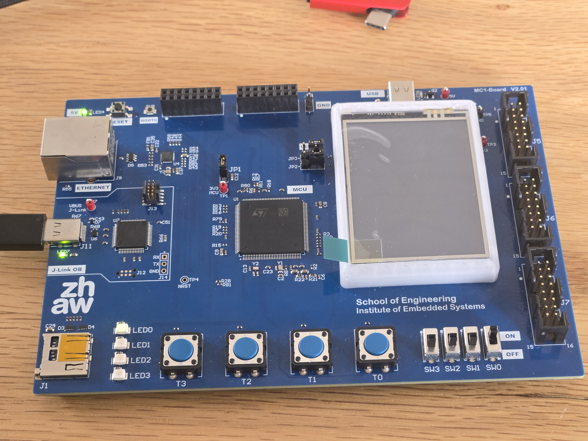

# PQC_BA_Zephyrproject

**Post Quantum Cryptography on Embedded Systems**  
Bachelor thesis from Julien Wyss and Hofer Levin <br>
04. June 2026

This repository is the main Zephyr project integration repository for evaluating Post-Quantum Cryptography (PQC) and classical algorithms on embedded systems.

---

## Table of Contents

- [PQC\_BA\_Zephyrproject](#pqc_ba_zephyrproject)
  - [Table of Contents](#table-of-contents)
  - [Summary](#summary)
  - [Project Documentation](#project-documentation)
  - [Architecture \& Software Stack](#architecture--software-stack)
    - [Algorithm Integration \& Validation](#algorithm-integration--validation)
  - [Repository Layout](#repository-layout)
    - [Folder Explanations](#folder-explanations)
  - [Zephyr Environment Setup](#zephyr-environment-setup)
    - [Prerequisites](#prerequisites)
    - [Installation Steps](#installation-steps)
  - [Test Workflow Overview](#test-workflow-overview)
  - [Credit and Disclaimer](#credit-and-disclaimer)
  - [License](#license)

---

## Summary

The `PQC_BA_Zephyrproject` provides the overarching Zephyr RTOS workspace that hosts the board setup and firmware required for evaluating post-quantum (PQC) and classical cryptographic algorithms on embedded hardware. 

The project ecosystem is intentionally decoupled into five distinct repositories: this main Zephyr integration hub, three independent algorithm-specific firmware sub-repositories (FIPS 203, FIPS 204, FIPS 205), and one host-side Python testing framework. This modular split prevents monolithic codebases, allows independent benchmarking of each algorithm pair, and decouples the embedded implementation from the host-side verification logic to avoid shared bugs. As the central hub, this repository contains the shared RTOS workspace, board definitions, and build environment required to compile, flash, and measure any of the constituent submodules onto the target STM32-based microcontroller.

This project is tailored to evaluate the feasibility, performance overhead, and footprint of the latest NIST post-quantum standards on constrained devices. The firmware is capable of running operations like key generation, encapsulation/decapsulation, and digital signing/verification, while streaming cycle counts and memory footprints directly back to a host interface.

The MC1 STM32 board, provided by [InES](#credit-and-disclaimer), was the main piece of hardware used for the algorithmic implementation and measurement in this project. 



---

## Project Documentation

The comprehensive documentation of this project is available in the `documentation/` folder. This folder hosts the main Bachelor thesis PDF, which contains the complete documentation of the system design, the theoretical background, and all of the final measurement results obtained during the evaluation.

---

## Architecture & Software Stack

The complete evaluation suite is split across five distinct repositories to ensure modularity and separate the embedded execution from the host-side verification logic:

- **Main Zephyr Integration Hub (This Repository):** Hosts the overarching Zephyr RTOS workspace, board definitions, and the initial build environment required to compile and flash the firmware.
- **Target Environment (Cryptographic Submodules):** Three independent Git sub-repositories containing C/C++ firmware implementations of the evaluated algorithms.
- **Host Environment (Python Testing Framework):** A decoupled Python host software that orchestrates test workflows, handles USB communication, and independently validates mathematical correctness.

### Algorithm Integration & Validation

To ensure complete modularity, the cryptographic implementations are integrated behind a uniform Zephyr interface and organized into implementation pairs (one classical, one PQC algorithm per submodule). 
- The active algorithm within a flashed pair is selectable at **runtime**.
- The specific implementation pair to test is selected at **build time** via `west build` command options, allowing the target firmware to compile alternative algorithms without modifying the logic or repository structure.

- **[FIPS203_Implementation](https://github.zhaw.ch/PQC-on-Microcontrollers/FIPS203_Implementation.git)**: ML-KEM vs ECDH
- **[FIPS204_Implementation](https://github.zhaw.ch/PQC-on-Microcontrollers/FIPS204_Implementation.git)**: ML-DSA vs ECDSA
- **[FIPS205_Implementation](https://github.zhaw.ch/PQC-on-Microcontrollers/FIPS205_Implementation.git)**: SLH-DSA vs RSA-PSS

**Host-side framework and testing concept:**  
To mitigate the risk of false-positive testing (e.g., if board code malfunctions and accidentally skips encryption, sending plaintext to an equally flawed host decoder), a multi-stage bidirectional cross-platform verification concept is integrated into the host-side framework: **[PQC_BA_HostTestingFramework](https://github.zhaw.ch/PQC-on-Microcontrollers/PQC_BA_HostTestingFramework.git)**.

Using the USB CDC-ACM virtual serial link, the board communicates with the host. For KEM algorithms, the host acts as the encapsulator and the board decapsulates, returning the recovered shared secret back to the host for an independent verification check. For signatures (DSA) or symmetric exchanges (ECDH), public keys and payloads are exchanged, and both sides independently derive or verify the results. Matching verification values across inherently independent execution platforms (C/C++ on firmware vs. Python on host) ensures mathematically and logically correct operations before benchmarking metrics (cycles/memory) are captured.

---

## Repository Layout

Below is an overview of the structural layout of this Zephyr workspace:

```text
PQC_BA_Zephyrproject/
├── design-requirements.tex       # Latex requirements document
├── README.md                     
├── build/                        # Generated Zephyr and CMake build artifacts
├── documentation/                # Project documentation and thesis PDF
├── firmware/
│   ├── HW_Test_Template/         # Hardware test and starter firmware template
│   ├── boards/st/mc1board/       # Board-specific Zephyr integration layer and devicetree
│   ├── modules/                  # Project-specific firmware extensions
│   └── git_submodules/           # Submodules for cryptographic benchmarks
│       ├── FIPS203_Implementation/
│       ├── FIPS204_Implementation/
│       └── FIPS205_Implementation/
└── hardware/
    ├── docs/                     # Hardware documentation (datasheets, pinout)
    ├── MC1_Board/                # Board hardware design files
    └── PCB_MC1_LCD/              # LCD/PCB hardware design files
```

### Folder Explanations
- **`documentation/`**: Hosts the main Bachelor thesis PDF, containing the complete theoretical background, project documentation, and final measurement results.
- **`hardware/`**: Contains the hardware documentation package for the MC1 platform, including board-level and display-related design baseline material. This folder acts as the hardware reference baseline for firmware integration and validation.
- **`firmware/HW_Test_Template/`**: Contains a minimal hardware test and template firmware application. It is used for board bring-up, basic peripheral validation (e.g., LEDs and buttons), and as a starting point for new firmware features. This implementation is based on Zephyr Project tutorials and sample code, adapted for this project's requirements.
- **`firmware/boards/`**: Contains board-specific integration assets for Zephyr, such as board configuration and hardware description files (Devicetree) required to map the firmware to the target platform.
- **`firmware/modules/`**: Contains additional project-specific modules and integration files that extend the base Zephyr environment with custom platform functionality.
- **`firmware/git_submodules/`**: Contains external Git sub-repositories used by the project, primarily for our cryptographic algorithm implementations and related benchmarking/test environments:
  - `FIPS203_Implementation`: Contains the integration repository for FIPS 203 (ML-KEM) and a classical key-exchange baseline (ECDH), including firmware-level test and performance evaluation setup.
  - `FIPS204_Implementation`: Contains the integration repository for FIPS 204 (ML-DSA) and a classical signature baseline (ECDSA), including firmware-level test orchestration and comparative evaluation setup.
  - `FIPS205_Implementation`: Contains the integration repository for FIPS 205 (SLH-DSA) and a classical signature baseline (RSA-PSS), including firmware-level test and performance evaluation setup.

---

## Zephyr Environment Setup

To begin development, set up the Zephyr and West environments. This repository supports **Zephyr v4.3.99**, **Zephyr SDK 0.17.4**, and **West v1.5.0**. The following instructions are a condensed version of the official [Zephyr Getting Started Guide](https://docs.zephyrproject.org/latest/develop/getting_started/index.html).

### Prerequisites
- Install host system dependencies (CMake, Python, Devicetree compiler, etc.) via your package manager (`apt`, `brew` or OS-specific package manager).
- Install Python 3.10 or newer (Python serves as the underlying requirement for host orchestration).

### Installation Steps

1. **Install West (Zephyr's meta-tool):**
   ```bash
   pip3 install --user -U west
   ```

2. **Clone the repository with submodules:**
   ```bash
   git clone --recurse-submodules
   ```

3. **Initialize the Zephyr Workspace:**
   Since you already cloned this repository, initialize West inside the workspace folder:
   ```bash
   # Navigate into the cloned repository
   cd PQC_BA_Zephyrproject
   
   # Initialize and pull dependencies
   west init -l .
   west update
   ```

4. **Export Zephyr CMake Packages:**
   ```bash
   west zephyr-export
   ```

5. **Install Python Dependencies:**
   ```bash
   pip3 install --user -r zephyr/scripts/requirements.txt
   ```

6. **Install the Zephyr SDK:**
   Download and install the Zephyr SDK for your system, which provides the necessary cross-compilers.
   ```bash
   # Please replace the version string below with the latest suitable version
   wget https://github.com/zephyrproject-rtos/sdk-ng/releases/download/v0.17.4/zephyr-sdk-0.17.4_linux-x86_64.tar.xz
   
   # Extract and run setup
   tar xvf zephyr-sdk-0.17.4_linux-x86_64.tar.xz
   cd zephyr-sdk-0.17.4
   ./setup.sh
   ```

---

## Test Workflow Overview

Detailed building and flashing instructions are maintained within the `README.md` of each respective algorithm submodule (e.g., `FIPS205_Implementation`). 

To successfully initiate a cross-platform test workflow, follow these sequential steps:
1. **Environment Setup:** Ensure the Zephyr environment and Python host dependencies are fully installed.
2. **Firmware Build:** Navigate to this main repository and use `west build` to compile the desired cryptographic submodule for your board.
3. **Flash Target:** Flash the compiled firmware onto the STM32 board via `west flash`.
4. **Host Connection:** Restart the board and ensure the USB communication port is connected to the host.
5. **Start Evaluation:** Launch the [Python Host-Side Testing Framework](https://github.zhaw.ch/PQC-on-Microcontrollers/PQC_BA_HostTestingFramework.git) to interact with the board, validate functionality, and record the benchmark metrics.

---

## Credit and Disclaimer

**Credit:**  
This project builds upon the Zephyr RTOS ecosystem. Setup and configuration guidelines derive from the official [Zephyr Getting Started Guide](https://docs.zephyrproject.org/latest/develop/getting_started/index.html).

Parts of the code and hardware used in this project, including the project structure, are based on software originally developed by the Institute of Embedded Systems (InES) at ZHAW. The original copyright notices and disclaimer statements are hereby preserved. The incorporated code has been modified and extended within the scope of this work and now serves as the foundation for the CDC ACM USB communication and platform integration.  
Original repository link: [InES/MC1_STM32H573](https://github.zhaw.ch/InES/MC1_STM32H573.git)

**Disclaimer:**  
All program code and technical text enclosed in this project were supported by LLMs (such as ChatGPT, Gemini, and GitHub Copilot) taking roles across code generation, syntax validation, textual refactoring, explanation, and auto-completion workflows.

---

## License

No explicit license is included in this repository. Add a formal license (e.g., MIT, Apache 2.0, GPL) if public broadcasting or reuse is planned.
