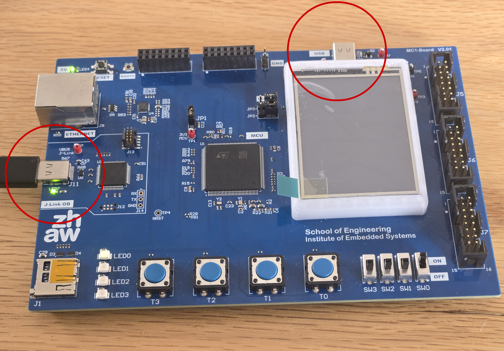
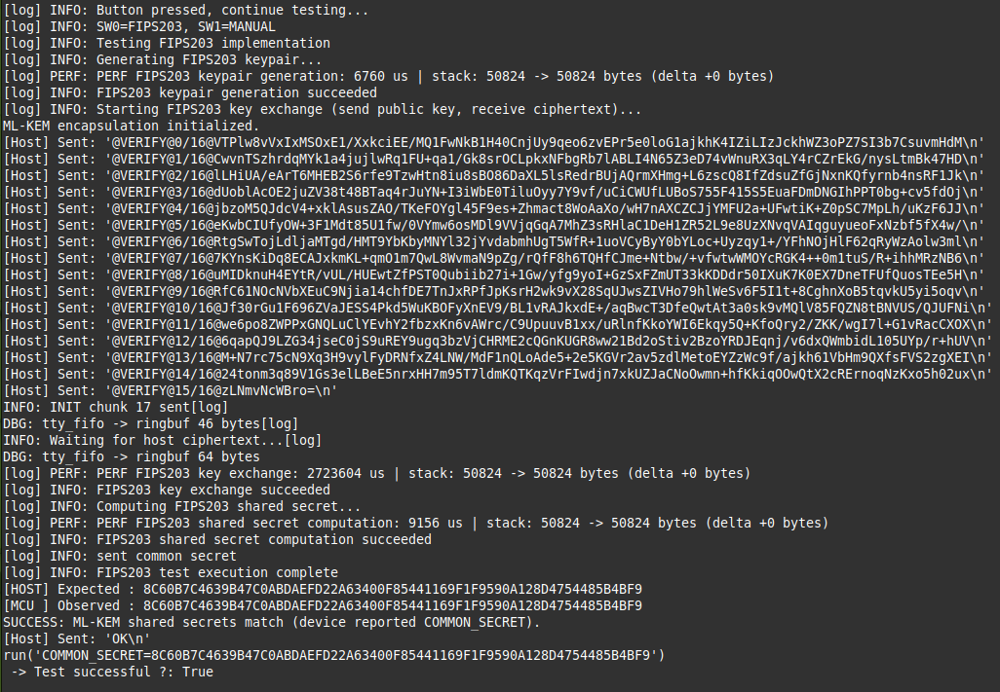
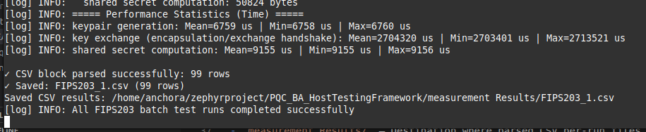

# FIPS203_Implementation

**Post Quantum Cryptography on Embedded Systems**  
Bachelor thesis from Julien Wyss and Hofer Levin <br>
06. June 2026

This repository contains the integration repository for FIPS 203 (ML-KEM) and a classical key exchange baseline (ECDH), including firmware-level test and performance evaluation setup.

---

## Table of Contents

- [FIPS203\_Implementation](#fips203_implementation)
  - [Table of Contents](#table-of-contents)
  - [Summary](#summary)
    - [What This Repository Measures](#what-this-repository-measures)
  - [Affiliation](#affiliation)
  - [Key Features](#key-features)
  - [Repository Layout](#repository-layout)
  - [How to Use](#how-to-use)
  - [How to Start Development](#how-to-start-development)
    - [Setup and Dependencies](#setup-and-dependencies)
    - [Hardware User Controls and Pins](#hardware-user-controls-and-pins)
    - [Protocols Supported](#protocols-supported)
      - [Framed Multi-part Payloads](#framed-multi-part-payloads)
    - [CSV Measurement Format](#csv-measurement-format)
  - [Testing \& Quality Metrics](#testing--quality-metrics)
  - [Project Documentation](#project-documentation)
  - [Development Notes and Troubleshooting](#development-notes-and-troubleshooting)
  - [Credit and Disclaimer](#credit-and-disclaimer)
  - [License](#license)

---

## Summary

This repository implements a test structure that exercises a post-quantum key encapsulation mechanism ML-KEM (parameter set 768) alongside a classical ECDH implementation. The firmware runs the full logical flows for both algorithms, which include keypair generation, peer exchange/encapsulation, and shared secret derivation. During a test run after the keypair generation, the board sends the public key to the host, waits for the host to return the ciphertext, then performs decapsulation and streams the recovered shared secret back to the host for independent validation.

At runtime, this program exposes two test modes selectable by onboard switches: a manual single-run mode triggered by a push-button and an automatic multi-run benchmarking workflow. One switch selects the algorithm (post-quantum vs classical) and the other selects manual vs automatic operation. Results, payloads, and public keys are streamed to the host in labeled, chunked blocks for independent validation and further processing.

### What This Repository Measures

This repository captures per-operation execution timings (key generation, key exchange, and shared secret computation) recorded per run and summarized as statistical aggregates (mean, min, max). 

- **Time Measurement:** To measure the execution time required by each algorithm, a software-based timing test is implemented on the firmware side. The firmware records cycle counts around each cryptographic operation using Zephyr timing functions and converts them to microseconds for reproducible comparison across multiple test runs. The goal is to obtain stable results that are not affected by transient CPU load by calculating the mean execution time of each task.
  
- **Memory Usage:** Using a similar approach, a software-based test is implemented to estimate the peak memory usage of the executed functions. The firmware samples the stack high-water mark before and after each operation, which provides an approximation of the memory footprint during execution and allows comparison between the PQC and classical counterparts.

For power analysis, the firmware toggles a dedicated GPIO probe immediately before and after each timed operation so external instruments can capture current/power traces aligned with the operation window. Time, stack measurements, and payloads are streamed as structured CSV blocks for host collection and post-processing.

---

## Affiliation

This repository was developed as a part of three independent algorithm-specific sub-repositories that each provide an embedded test harness to evaluate and compare post-quantum and classical signature or key-exchange algorithms on a Zephyr STM32 target.

List of the three sub-repositories:
- [FIPS203_Implementation](https://github.zhaw.ch/PQC-on-Microcontrollers/FIPS203_Implementation.git) (This Repo)
- [FIPS204_Implementation](https://github.zhaw.ch/PQC-on-Microcontrollers/FIPS204_Implementation.git)
- [FIPS205_Implementation](https://github.zhaw.ch/PQC-on-Microcontrollers/FIPS205_Implementation.git)

To ensure modularity, the cryptographic implementations (like this one) are integrated behind a Zephyr interface. The algorithms are organized into pairs, where each pair contains one classical algorithm and one post-quantum counterpart for direct comparison. The different implementation pairs are selected at build time through `west build` command options, allowing the Zephyr project to be compiled with alternative pairs without modifying the repository structure or logic.

Therefore, this repository will NOT work on its own without its upstream Zephyr project repository:  
[PQC_BA_Zephyrproject](https://github.zhaw.ch/PQC-on-Microcontrollers/PQC_BA_Zephyrproject.git)

The task of this repository is to provide an implementation base for the two algorithms (FIPS 203 and ECDH) as well as provide an embedded test harness to evaluate and compare post-quantum and classical key exchange and encapsulation algorithms.

Additionally, to see, evaluate, and process the information sent by this program over USB, the Host-side Python listener application framework is required. It acts as a debugging console output provider as well as a communication partner for the board.  
This Host-side framework can be found at: [PQC_BA_HostTestingFramework](https://github.zhaw.ch/PQC-on-Microcontrollers/PQC_BA_HostTestingFramework.git)

Find further documentation at [Project Documentation](#project-documentation).

---

## Key Features

This repository provides:
- **Algorithm Implementations:** FIPS 203 (ML-KEM) and ECDH integrated for an embedded target.
- **Benchmarking Framework:** Built-in tools for measuring execution time and memory usage.
- **Power Analysis Support:** GPIO toggling for external oscilloscope synchronization.
- **USB Data Transmission:** Structured payload streaming to send metrics and crypto outputs (public key, ciphertext/key shares, and computed shared secret) to the host.
- **Configurable Test Modes:** Hardware switch-based control over execution mode (single run vs multi-run batch) and algorithm selection.

---

## Repository Layout

- `CMakeLists.txt` — Build setup for Zephyr. Defines the board, lists the compiled source files and handles the real/mock FIPS 203 implementation switch.
- `FIPS203_ML_KEM_INTEGRATION.md` — Additional integration documentation for FIPS 203.
- `mc1board.overlay` — Device-tree overlay for USB CDC-ACM console routing on the target board.
- `prj.conf` — Main Zephyr configuration (USB/console/logging settings, enabling peripherals).
- `README.md` — Project documentation (this file).
- `src/main.c` — Main firmware flow. Initializes hardware, executes key generation and key exchange tests, and sends the payload over USB.
- `src/ECDHA_implementation.c` & `.h` — Classical ECDH implementation used for comparison.
- `src/Fips203_dispatch.c` — Compile-time dispatcher that selects between a mock or real FIPS 203 implementation.
- `src/Fips203_implementation.c` — Mock ML-KEM implementation used for host-side false-positive testing.
- `src/Fips203_implementation.cpp` & `.h` — Real FIPS 203 wrapper around the bundled ML-KEM-768 C++ implementation.
- `src/user_usb.c` & `.h` — USB output/input helpers used to print logs and send payloads to the host.
- `Fips203 C++ implementation Full Repo/` — Upstream source directory containing the ML-KEM C++ reference implementation.
  - `ml-kem/` — Core ML-KEM implementation.
  - `randomshake/` — SHAKE-based RNG utilities dependency.
  - `sha3/` — SHA-3 / Keccak primitives dependency.
  - `subtle/` — Constant-time helpers dependency.

---

## How to Use

1. **Connect the Board:** Connect the J-Link OB USB Port from the STM32 board to the computer running the Zephyr environment. On Linux, it typically appears as `/dev/SEGGER J-Link`.
2. **Build the Project:** Use the West build tool to build and flash this program from the upstream Zephyr project. See [Affiliation](#affiliation) for more information. This project cannot be used as a standalone application.
   
   ```bash
   # Build
   west build -b mc1board firmware/git_submodules/FIPS203_Implementation/ -p always

   # Flash to board
   west flash --runner jlink

   # A new terminal might need to be sourced first
   source ../.venv/bin/activate
   ```

   **Note:** You can use mock FIPS 203 implementation by turning on the `USE_FIPS203_MOCK` flag in `CMakeLists.txt` prior to building.

3. **Reconnect USB:** If only one USB cable is available, the board needs to be reconnected using the communication USB port (no longer the J-Link OB Port) after a successful flash.



4. **Start Python Host Listener:** To see the transmission sent by the board, start the listener application from the Python Host framework utility described here: [PQC_BA_HostTestingFramework](https://github.zhaw.ch/PQC-on-Microcontrollers/PQC_BA_HostTestingFramework.git).

5. **Choose Algorithm and Test Method:** Once connected, the Host framework displays the received information from the board. 
   - Select the algorithm with switch `SW0`.
   - Select the test method (single run or batch run) with switch `SW1`. 
   - The number of batch runs can be adjusted via the `number_of_batch_tests` variable in `src/main.c`.
   - Start or rerun tests manually with button `T3`. 



6. **Results:** The terminal on the host side will display test outcomes. Verification implementations on the host side will return `True` (success), `False` (failure), or an error depending on whether the decoded values or the shared secret match. Payload data and measurement results (CSV formats) will be written to the host's measurement results folder.
   


---

## How to Start Development

### Setup and Dependencies

The primary dependencies are the Zephyr and West environments, which can be found together with the installation guidelines in [PQC_BA_Zephyrproject](https://github.zhaw.ch/PQC-on-Microcontrollers/PQC_BA_Zephyrproject.git).

### Hardware User Controls and Pins

- **Buttons / Pushbuttons**
  - `T3` (`t3` in devicetree): Manual test trigger. <br> Pressing it requests a test run.
- **Switches**
  - `SW0` (`sw0` in devicetree): Algorithm selection switch.<br> High (ON) = FIPS 203 (ML-KEM), Low (OFF) = ECDH.
  - `SW1` (`sw1` in devicetree): Mode selection switch.<br> High (ON) = automatic multi-run batch tests, Low (OFF) = manual trigger via `T3`.
- **Oscilloscope Probe (OSZI)**
  - Physical pin: `PD3` on header `J5` (devicetree node `headers/header_j5/pd3`).
  - Usage: Driven high immediately before a timed cryptographic operation and set low immediately after. No prints or USB activity occur while the pin is high. 
  - *Note for builders:* If you see devicetree macro resolution errors related to `pd3`, it is safe —<br> `main.c` initializes this port/pin at runtime. No devicetree overlay is required when targeting the stock MC1 board. For custom boards, update the DTS accordingly.

### Protocols Supported

The host framework uses specifically shaped payloads to communicate with the embedded board. The board transmits these formats as follows on the USB CDC-ACM link:

#### Framed Multi-part Payloads
Useful for public key transmission and ciphertext. The system exchanges data via tagged markers:
- `@INIT` ... `@END_INIT` (INIT chunks are sent to the host representing the board's public key components).
- `@VERIFY` ... `@END_VERIFY` (VERIFY chunks are received back as host ciphertext).
- Other base64 formats sent per the tag-based protocol. Let the Host framework reassemble multi-part messages in sequences.

### CSV Measurement Format

The device packages hardware-recorded metrics into CSV formats to document footprint and timing structures. When automatic multi-run tests finish, the firmware sends a block formatted as follows:

```text
#start#
algorithm,stage,run,time_us,stack_before,stack_after,stack_used_bytes,stack_ok
FIPS203,keypair generation,1,12345,1024,2048,1024,true
FIPS203,key exchange (encapsulation/exchange handshake),1,54321,2048,3072,1024,true
FIPS203,shared secret computation,1,6789,2048,2500,452,true
#stop#
```

Notes for the host parser:
- Treat everything between `#start#` and `#stop#` as one CSV dataset.
- The firmware may transmit the block in multiple USB chunks, so the host reassembles the received text until the closing delimiter appears.
- The `algorithm` column is either `ECDH` or `FIPS203`.
- The `stage` column matches the algorithmic step evaluated.

---

## Testing & Quality Metrics

To minimize the risk of false-positive validation on the target, we perform bidirectional cross-platform functional tests via the USB CDC-ACM virtual serial link. For ML-KEM, the host acts as the encapsulator. The board sends its public key and the host returns an encapsulated ciphertext. The board then decapsulates the ciphertext and transmits the recovered shared secret back to the host for independent verification. For ECDH, the process is symmetrical: both sides exchange public keys and derive the same shared secret independently, which the board then reports back to the host for confirmation. Matching secrets (or verified signatures) combined with an independent host implementation (different language and library) significantly reduces the chance of a misleading pass resulting from a shared bug.

Additionally, a mock implementation of the FIPS 203 algorithm can be used for false positive testing and to decouple the USB connection from the FIPS 203 implementation. This can be enabled by setting the `USE_FIPS203_MOCK` flag in the `CMakeLists.txt` file prior to building.

---

## Project Documentation

Detailed code-level instructions have been maintained natively via Doxygen-style docstrings located directly above class and function signatures.

For full project documentation, please see:  
[Bachelor Thesis: Post Quantum Cryptography on Embedded Systems](https://github.zhaw.ch/PQC-on-Microcontrollers/PQC_BA_Zephyrproject/blob/a9101a9e0b001126c7fda937e06dd11a00620328/documentation/BA%20FS%2026_kuex_168.pdf)

Documentation regarding the board implementation and Zephyr configuration natively belongs to the [PQC_BA_Zephyrproject](https://github.zhaw.ch/PQC-on-Microcontrollers/PQC_BA_Zephyrproject.git) repository.

---

## Development Notes and Troubleshooting

- Ensure the USB buffer does not overflow when reading large strings. If payload corruption occurs, slow down string generation or reduce print lengths.
- Heap measurement tools were not implemented since the implemented algorithms do not rely on the heap space. Therefore, usage would constantly be zero.
- If two USB cables are used simultaneously and the board is not recognized by the host or does not send anything to the host, this could happen because the host registered the wrong USB connection (J-Link instead of the communication USB). To solve this, unplug all USB cables from the board and first insert the communication USB. After the host has recognized the board, insert the second USB (J-Link) again.

---

## Credit and Disclaimer

**Credit:**  
This project integrates ML KEM 768 (FIPS 203 ML KEM family) via a bundled C++20 reference implementation and exposes a small extern "C" wrapper so the Zephyr C application can call keygen, encapsulate and decapsulate. The ML KEM implementation provides an IND CCA KEM construction based on module LWE and targets the 768 parameter set in this firmware. The ML KEM subtree used here is maintained at itzmeanjan's [ml-kem](https://github.com/itzmeanjan/ml-kem.git) Git Repo and is built as part of the firmware image; its internal dependencies included with the subtree are sha3 (SHA 3 / Keccak primitives), randomshake (SHAKE based RNG utilities) and subtle (constant time helpers). These dependencies are automatically fetched via the ML-KEM dependency list using FetchContent during the build process. This repository also contains an on-board ECDH implementation used as a classical baseline and protocol comparator (keypair generation, public key export/import, shared secret derivation).

Parts of the code, including but not limited to the USB transfer protocol found in `src/user_usb.c`, are inspired and to some degree directly based on software originally developed by the Institute of Embedded Systems (InES) at ZHAW. The [InES/MC1_STM32H573](https://github.zhaw.ch/InES/MC1_STM32H573.git) repository was provided by the InES institute alongside the MC1 Hardware board for this project. The original copyright notices and disclaimer statements have been preserved. The incorporated code has been modified and extended within the scope of this work and now serves as the foundation for the CDC ACM USB communication.

**Disclaimer:**  
All program code and technical text enclosed in this project were supported by LLMs (such as ChatGPT, Gemini, and GitHub Copilot) taking roles across code generation, syntax validation, textual refactoring, explanation, and auto-completion workflows.

---

## License

No explicit license is included in this repository. Add a formal license (e.g., MIT, Apache 2.0, GPL) if public broadcasting or reuse is planned.
