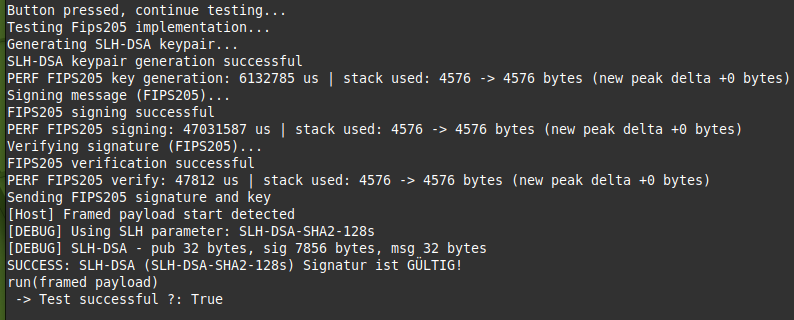
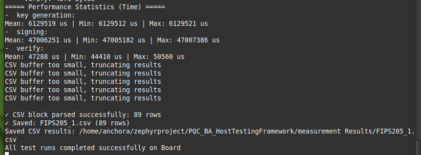

# FIPS205_Implementation

**Post Quantum Cryptography on Embedded Systems**  
Bachelor thesis from Julien Wyss and Hofer Levin <br>
06. June 2026

This repository contains the integration repository for FIPS 205 (SLH-DSA) and a classical signature baseline (RSA-PSS), including firmware-level test and performance evaluation setup.

---

## Table of Contents

- [FIPS205\_Implementation](#fips205_implementation)
  - [Table of Contents](#table-of-contents)
  - [Summary](#summary)
    - [What This Repository Measures](#what-this-repository-measures)
  - [Affiliation](#affiliation)
  - [Key Features](#key-features)
  - [Repository Layout](#repository-layout)
  - [How to Use](#how-to-use)
  - [How to Start Development](#how-to-start-development)
    - [Setup and Dependencies](#setup-and-dependencies)
    - [Hardware User Controls and Pins](#hardware-user-controls-and-pins)
    - [Protocols Supported](#protocols-supported)
      - [Framed Multi-part Payloads](#framed-multi-part-payloads)
    - [CSV Measurement Format](#csv-measurement-format)
  - [Testing \& Quality Metrics](#testing--quality-metrics)
  - [Project Documentation](#project-documentation)
  - [Development Notes and Troubleshooting](#development-notes-and-troubleshooting)
  - [Credit and Disclaimer](#credit-and-disclaimer)
  - [License](#license)

---

## Summary

This repository provides a test structure to evaluate and compare the post-quantum and classical signature algorithms FIPS 205 (SLH-DSA) and RSA-PSS. For the algorithms under test, the firmware performs full functional operations (key generation, signing, and verification). It then transmits the public key, signature, and original message to the host for independent validation.

At runtime, this program exposes two test modes selectable by onboard switches: a manual single-run mode triggered by a pushbutton and an automatic multi-run benchmarking workflow. One switch selects the algorithm (post-quantum vs classical) and the other selects manual vs automatic operation. Signed results, payloads, and public keys are streamed to the host in labeled, chunked blocks for independent validation and further processing.

### What This Repository Measures

This repository captures per-operation execution timings (key generation, signing, and verification) recorded per run and summarized as statistical aggregates (mean, min, max). 

- **Time Measurement:** To measure the execution time required by each algorithm, a software-based timing test is implemented on the firmware side. The firmware records cycle counts around each cryptographic operation using Zephyr timing functions and converts them to microseconds for reproducible comparison across multiple test runs. The goal is to obtain stable results that are not affected by transient CPU load by calculating the mean execution time of each task.
  
- **Memory Usage:** Using a similar approach, a software-based test is implemented to estimate the peak memory usage of the executed functions. The firmware samples the stack high-water mark before and after each operation, which provides an approximation of the memory footprint during execution and allows comparison between the PQC and classical counterpart.

For power analysis, the firmware toggles a dedicated GPIO probe immediately before and after each timed operation so external instruments can capture current/power traces aligned with the operation window. Time, stack measurements, and payloads are streamed as structured CSV blocks for host collection and post-processing.

---

## Affiliation

This repository was developed as a part of three independent algorithm-specific sub-repositories that each provide an embedded test harness to evaluate and compare post-quantum and classical signature or key-exchange algorithms on a Zephyr STM32 target.

List of the three sub-repositories:
- [FIPS203_Implementation](https://github.zhaw.ch/PQC-on-Microcontrollers/FIPS203_Implementation.git)
- [FIPS204_Implementation](https://github.zhaw.ch/PQC-on-Microcontrollers/FIPS204_Implementation.git)
- [FIPS205_Implementation](https://github.zhaw.ch/PQC-on-Microcontrollers/FIPS205_Implementation.git) (This Repo)

To ensure modularity, the cryptographic implementations (like this one) are integrated behind a Zephyr interface. The algorithms are organized into pairs, where each pair contains one classical algorithm and one post-quantum counterpart for direct comparison. The different implementation pairs are selected at build time through `west build` command options, allowing the Zephyr project to be compiled with alternative pairs without modifying the repository structure or logic.

Therefore, this repository will NOT work on its own without its upstream Zephyr project repository:  
[PQC_BA_Zephyrproject](https://github.zhaw.ch/PQC-on-Microcontrollers/PQC_BA_Zephyrproject.git)

The task of this repository is to provide an implementation base for the two algorithms (FIPS 205 and RSA-PSS) as well as provide an embedded test harness to evaluate and compare post-quantum and classical signature algorithms.

Additionally, to see, evaluate, and process the information sent by this program over USB, the Host-side Python listener application framework is required. It acts as a debugging console output provider as well as a communication partner for the board.  
This Host-side framework can be found at: [PQC_BA_HostTestingFramework](https://github.zhaw.ch/PQC-on-Microcontrollers/PQC_BA_HostTestingFramework.git)

Find further documentation at [Project Documentation](#project-documentation).

---

## Key Features

This repository provides:
- **Algorithm Implementations:** FIPS 205 (SLH-DSA) and RSA-PSS integrated for an embedded target.
- **Benchmarking Framework:** Built-in tools for measuring execution time and memory usage.
- **Power Analysis Support:** GPIO toggling for external oscilloscope synchronization.
- **USB Data Transmission:** Structured payload streaming to send metrics and crypto outputs (public key, signature, message) to the host.
- **Configurable Test Modes:** Hardware switch-based control over execution mode (single run vs multi-run batch) and algorithm selection.

---

## Repository Layout

- `CMakeLists.txt` — Build setup for Zephyr. Defines the board and lists the compiled source files.
- `prj.conf` — Main Zephyr configuration (stack size, mbedTLS/RSA options, USB/console/logging settings, enabling peripherals).
- `mc1board.overlay` — Device-tree overlay for USB CDC-ACM console routing on the target board.
- `README.md` — Project documentation.
- `src/main.cpp` — Main firmware flow. Initializes hardware, generates keys, signs a test message, and sends payload over USB.
- `src/RSAPSS_implementation.cpp` \& `.h` — mbedTLS-based RSA-PSS implementation (RNG setup, key generation, SHA-256 hashing, sign/verify logic).
- `src/Fips205_implementation.c` \& `.h` — Wrapper implementation for SLH-DSA key generation, signing, and verification.
- `src/USBcommunication.cpp` \& `.h` — USB output helpers used to print logs and send payloads to the host.
- `Fips205 C implementation Full Repo/slhdsa-c-main/` — Upstream source directory for SLH-DSA (FIPS 205) reference C implementation.

---

## How to Use

1. **Connect the Board:** Connect the J-Link OB USB Port from the STM32 board to the computer running the Zephyr environment. On Linux, it typically appears as `/dev/SEGGER J-Link`.
2. **Build the Project:** Use the West build tool to build and flash this program from the upstream Zephyr project. See [Affiliation](#affiliation) for more information. This project cannot be used as a standalone application.
   
   ```bash
   # Build
   west build -b mc1board firmware/git_submodules/FIPS205_Implementation/ -p always


   # Flash to board
   west flash --runner jlink

   # A new terminal might need to be sourced first
   source ../.venv/bin/activate

   ```
3. **Reconnect USB:** If only one USB cable is available, the board needs to be reconnected using the communication USB port (no longer the J-Link OB Port) after a successful flash.


4. **Start Python Host Listener:** To see the transmission sent by the board, start the listener application from the Python Host framework utility described here: [PQC_BA_HostTestingFramework](https://github.zhaw.ch/PQC-on-Microcontrollers/PQC_BA_HostTestingFramework.git).

5. **Choose Algorithm and Test Method:** Once connected, the Host framework displays the received information from the board. 
   - Select the algorithm with switch `SW0`.
   - Select the test method (single run or batch run) with switch `SW1`. 
   - The number of batch runs can be adjusted via the `number_of_test_Runs` variable in `src/main.cpp`.
   - Start or rerun tests manually with button `T3` (When LED0 is blinking, the programm is ready for next user input)



6. **Results:** The terminal on the host side will display test outcomes. Verification implementations will return `True` (success), `False` (failure), or an error. Payload data and measurement results (CSV formats) will be written to the `measurement Results/` folder on the host.
   


---

## How to Start Development

### Setup and Dependencies

The primary dependencies are the Zephyr and West environments, which can be found together with the installation guidelines in [PQC_BA_Zephyrproject](https://github.zhaw.ch/PQC-on-Microcontrollers/PQC_BA_Zephyrproject.git).

### Hardware User Controls and Pins

- **Buttons / Pushbuttons**
  - `T3` (`t3` in devicetree): Manual test trigger. <br> Pressing it requests a test run.
- **Switches**
  - `SW0` (`sw0` in devicetree): Algorithm selection switch.<br> High = FIPS 205 (SLH-DSA), Low = RSA-PSS.
  - `SW1` (`sw1` in devicetree): Mode selection switch.<br> High = automatic multi-run tests, Low = manual trigger via `T3`.
- **LEDs**
  - `LED0` (`led0` in devicetree): Status/heartbeat indicator.<br> Fast blinking means the program is waiting for user input.
- **Oscilloscope Probe (OSZI)**
  - Physical pin: `PD3` on header `J5` (devicetree node `headers/header_j5/pd3`).
  - Usage: Driven high immediately before a timed cryptographic operation and set low immediately after. No prints or USB activity occur while the pin is high. 
  - *Note for builders:* If you see devicetree macro resolution errors related to `pd3`, it is safe —<br> `main.cpp` initializes this port/pin at runtime. No devicetree overlay is required when targeting the stock MC1 board. For custom boards, update the DTS accordingly.


### Protocols Supported

The host framework uses specifically shaped payloads to communicate with the embedded board. The board transmits these formats as follows:

#### Framed Multi-part Payloads
Useful for signature verification and large cryptographic messages. Data is enclosed between explicit markers:
- `@PUB` ... `@END_PUB`
- `@SIG` ... `@END_SIG`
- `@MSG` ... `@END_MSG`
- `@END_ALL` — Indicates to the host that all base64 data regions have been successfully sent.

### CSV Measurement Format

The device packages hardware-recorded metrics into CSV formats to document footprint and timing structures. When automatic multi-run tests finish, the firmware sends a block formatted as follows:

```text
#start#
algorithm,stage,run,time_us,stack_before,stack_after,stack_used_bytes,stack_ok
FIPS205,key_generation,1,12345,1024,2048,1024,true
FIPS205,signing,1,54321,2048,3072,1024,true
FIPS205,verify,1,6789,2048,2500,452,true
#stop#
```

Notes for the host parser:
- Treat everything between `#start#` and `#stop#` as one CSV dataset.
- The firmware may transmit the block in multiple USB chunks, so the host reassembles the received text until the closing delimiter appears.
- The `algorithm` column is either `RSA` or `FIPS205`.
- The `stage` column is one of `key_generation`, `signing`, or `verify`.

---

## Testing \& Quality Metrics

To minimize the risk of false-positive validation on the target, cross-platform functional tests are performed. For digital signatures, testing is primarily unidirectional over USB from the board to the host. The firmware generates and verifies signatures locally on the microcontroller before transmitting the public key, signature, and message to the host. This allows the host's reference implementation to perform independent verification of the signed message. Matching signatures combined with an independent host implementation (different language and library) significantly reduces the chance of a misleading pass resulting from a shared bug.

---

## Project Documentation

Detailed code-level instructions have been maintained natively via Doxygen-style docstrings located directly above class and function signatures.

For full project documentation, please see:  
[Bachelor Thesis: Post Quantum Cryptography on Embedded Systems](https://github.zhaw.ch/PQC-on-Microcontrollers/PQC_BA_Zephyrproject/blob/a9101a9e0b001126c7fda937e06dd11a00620328/documentation/BA%20FS%2026_kuex_168.pdf)

Documentation regarding the board implementation and Zephyr configuration natively belongs to the [PQC_BA_Zephyrproject](https://github.zhaw.ch/PQC-on-Microcontrollers/PQC_BA_Zephyrproject.git) repository.

---

## Development Notes and Troubleshooting

- Ensure the USB buffer does not overflow when reading large strings. If payload corruption occurs, slow down string generation or reduce print lengths.
- This USB integration only allows unidirectional communication to the host. To expand the functionality to bidirectional communication, take a look at the userUSB implementation of the [FIPS203_Implementation](https://github.zhaw.ch/PQC-on-Microcontrollers/FIPS203_Implementation.git) repository.
- Heap measurement tools were not implemented since the implemented algorithms do not rely on the heap space. Therefore, usage would constantly be zero.
- If two USB cables are used simultaneously and the board is not recognized by the host or does not send anything to the host, this could happen because the host registered the wrong USB connection (J-Link instead of the communication USB). To solve this, unplug all USB cables from the board and first insert the communication USB. After the host has recognized the board, insert the second USB (J-Link) again.

---

## Credit and Disclaimer

**Credit:**  
This project integrates a post-quantum SLH-DSA (FIPS-205) implementation via a wrapper around the upstream [slh-dsa/slhdsa-c](https://github.com/slh-dsa/slhdsa-c.git) Git repository, invoking a selected SLH parameter set. Cryptographic primitives included are SHA-2 (SHA-256 and SHA-512) and SHA-3 (Keccak-f1600) implementations and the SLH glue code. The classical baseline uses RSA-PSS primitives from the platform crypto stack (mbedTLS) for RNG, key generation, signing, and verification. 

Parts of the code, including but not limited to the USB transfer protocol found in `src/USBcommunication.cpp`, are inspired by the [InES/MC1_STM32H573](https://github.zhaw.ch/InES/MC1_STM32H573.git) repository,  provided by the ZHAW InES institute alongside the MC1 Hardware board for this project.

**Disclaimer:**  
All program code and technical text enclosed in this project were supported by LLMs (such as ChatGPT, Gemini, and GitHub Copilot) taking roles across code generation, syntax validation, textual refactoring, explanation, and auto-completion workflows.

---

## License

No explicit license is included in this repository. Add a formal license (e.g., MIT, Apache 2.0, GPL) if public broadcasting or reuse is planned.
